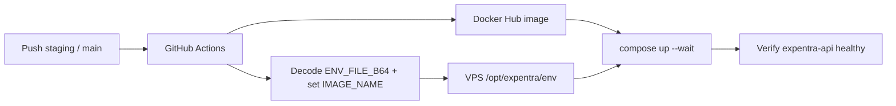

# Expentra API — Deployment Guide

Production/staging deploy for the NestJS backend (`expentra`) on a VPS with Docker Compose.

## Architecture

| Layer | Service | Responsibility |
|-------|---------|----------------|
| Source control | GitHub | Code, PRs, branch protection |
| CI | GitHub Actions ([`ci.yml`](.github/workflows/ci.yml)) | Lint, typecheck, test, build on PRs into `staging` / `main` |
| CD | GitHub Actions ([`deploy-staging.yml`](.github/workflows/deploy-staging.yml), [`deploy-production.yml`](.github/workflows/deploy-production.yml)) | Build image → Docker Hub → VPS |
| Runtime | VPS + Docker Compose | Postgres, Redis, API, worker, backups |



## Branch → environment map

| Branch | Workflow | GitHub Environment | Compose override | Env file on VPS | Image tag |
|--------|----------|--------------------|------------------|-----------------|-----------|
| `main` | [`deploy-production.yml`](.github/workflows/deploy-production.yml) | `production` | `docker-compose.prod.yml` | `env/.env.production` | `sha-<commit>` (also pushes `:latest`) |
| `staging` | [`deploy-staging.yml`](.github/workflows/deploy-staging.yml) | `staging` | `docker-compose.staging.yml` | `env/.env.staging` | `sha-<commit>` (also pushes `:staging`) |

Each workflow can also be run manually via **Actions → workflow_dispatch**.

Create both environments under **Settings → Environments**. Put secrets **on each environment** (same names, different values).

Fixed VPS layout:

```text
/opt/expentra/
  compose/          # synced from deploy/compose (no compose/.env)
  env/              # single env file from ENV_FILE_B64 (+ IMAGE_NAME set by CI)
  scripts/          # synced from deploy/scripts
```

## GitHub Environment secrets

Configure under **Settings → Environments → production** and **→ staging**.

Use the **same secret names** in both environments:

| Secret | Purpose |
|--------|---------|
| `ENV_FILE_B64` | Base64 of that environment’s full `.env` file (may include a placeholder `IMAGE_NAME`) |
| `DOCKERHUB_USERNAME` | Docker Hub username |
| `DOCKERHUB_TOKEN` | Docker Hub access token (read/write for push; read for VPS pull) |
| `DOCKERHUB_IMAGE` | Image repository without tag (e.g. `youruser/expentra`). Prefer an Environment **Variable** (not a Secret) — values that include secrets are redacted from job outputs. |
| `VPS_HOST` | VPS hostname or IP |
| `VPS_USER` | SSH user (must be in the `docker` group) |
| `VPS_SSH_KEY` | Private SSH key for that user |
| `VPS_KNOWN_HOSTS` | Pinned SSH host keys (output of `ssh-keyscan -H <host>`) |

CI writes one file (`env/.env.production` or `env/.env.staging`), upserts `IMAGE_NAME` to the image just pushed, and also writes `env/.image-name` (read on the VPS so the image is never passed through secret-redacted SSH env). Compose gets a tiny `compose/.env` containing only `IMAGE_NAME` for interpolation. After start, deploy fails if `docker inspect` does not show the new `sha-<commit>` tag.

If migrate/start/health fails, the job **fails without auto-rollback** and keeps the attempted `sha-<commit>` (so the VPS is not silently left on an older image). Check Actions logs for `Keeping attempted image`. Fix the root cause (often missing Postgres TLS certs, now auto-generated on deploy if absent) and redeploy.

**Important:** A Docker Hub Autobuild success is not a VPS deploy. Only the GitHub Actions **Deploy Staging** / **Deploy Production** jobs update `/opt/expentra-*/env` and recreate containers. Prefer `DOCKERHUB_IMAGE` as an Environment **variable** (not a secret) so image names are not redacted in Actions.

### Pin `VPS_KNOWN_HOSTS`

Run once from a trusted machine and store the **full output** as the environment secret (do not use live `ssh-keyscan` in CI):

```bash
ssh-keyscan -H your.vps.hostname.or.ip
```

Example images after push:

- Both environments deploy **`youruser/expentra:sha-<commit>`** (immutable)
- Also push floating pointers: `:staging` / `:latest` for convenience

### Deploy sequence (staging + production)

1. Capture previous `IMAGE_NAME` from the VPS (for rollback)  
2. Sync compose/scripts + write env with the new SHA image  
3. Pull image; start Postgres + Redis (`--wait`)  
4. Run dedicated Compose service: `docker compose run --rm migrate` (`scripts/docker-migrate.sh`)  
5. Start `api` + `worker` (+ backup) with `--wait`  
6. HTTP-check `GET http://api:3200/api/health/ready` on the Compose network (not host localhost)  
7. On migrate / start / health failure → restore previous `IMAGE_NAME`, restart api/worker, fail the job  

### Migration safety (important)

Automatic rollback restores the **previous application image** only. Schema migrations already applied are **not** auto-reverted — and that is intentional. No deploy script can make schema rollbacks safe in the general case.

Design migrations so an app-image rollback remains valid **without** reverting the database:

1. **Expand** — additive, backward-compatible changes (new nullable columns, new tables, new indexes). Deploy migration, then deploy code that uses them.
2. **Migrate data** — backfill in a way both old and new app versions tolerate.
3. **Contract** — drop/rename only after the old app version is gone and no longer reads the old shape.

Avoid one-shot breaking changes (drop column + deploy new code in the same release) unless you accept that image rollback will fail against the new schema.

### Encode a local env file

**Windows (PowerShell):**

```powershell
[Convert]::ToBase64String([IO.File]::ReadAllBytes("C:\path\to\.env.production"))
```

**macOS / Linux:**

```bash
base64 -w0 .env.production   # Linux
base64 -i .env.production | tr -d '\n'   # macOS
```

Paste into that environment’s `ENV_FILE_B64` secret. Do not commit the plain `.env` file.

### Values the encoded env must include for Docker Compose

Use the in-compose service hostnames (not `localhost`):

| Variable | Typical Docker value |
|----------|----------------------|
| `IMAGE_NAME` | Optional placeholder; CI overwrites with `youruser/expentra:sha-<commit>` |
| `PORT` | `3200` |
| `POSTGRES_HOST` | `postgres` (Compose service name) |
| `POSTGRES_PORT` | `5432` |
| `POSTGRES_SSL` | `true` (staging/production) |
| `POSTGRES_SSL_REJECT_UNAUTHORIZED` | `true` |
| `POSTGRES_SSL_CA` | `/certs/postgres/ca.crt` |
| `REDIS_HOST` | `redis` |
| `REDIS_PORT` | `6379` |
| `REDIS_URL` | `redis://redis:6379` (literal — do not use `${REDIS_HOST}` in the file) |
| `REDIS_DISABLE_SSL` | `true` |
| `NODE_ENV` | `production` |
| `TRUST_PROXY` | `true` |
| `APP_URL` | `https://app.yourdomain.com` |
| `ALLOWED_ORIGINS` | `https://app.yourdomain.com` |

Start from [`.env.example`](.env.example), then set production secrets (JWT, DB password, Cloudinary, etc.).

## VPS one-time setup

1. Install Docker Engine + Compose plugin.
2. Create deploy user with SSH key auth and membership in the `docker` group.
3. Ensure `/opt/expentra` is writable by that user.
4. Open firewall as needed for your edge proxy; do **not** allow inbound `5432`/`6379` from the WAN. Postgres is bound to `127.0.0.1:5432` only (SSH tunnel). The API is not published on the host (`expose` only) — reach it via your edge proxy or `docker exec`.
5. Create GitHub Environments `production` and `staging`, add the secrets above to each, then push to `main` / `staging` (or run **Deploy Production** / **Deploy Staging** manually).

First deploy syncs compose/scripts and writes the env file from `ENV_FILE_B64`. Later deploys use pinned `VPS_KNOWN_HOSTS`, the `migrate` Compose service, HTTP `/api/health/ready` checks, and automatic app-image rollback on failure. Old images are **not** pruned automatically.

## Database access (TablePlus / pgAdmin)

Postgres stays private. App containers use `POSTGRES_HOST=postgres` and connect with **TLS** (`POSTGRES_SSL=true` + CA). GUI tools connect over **SSH**, then to loopback on the VPS.

### One-time: generate TLS certs on the VPS

Certs live outside git (per environment):

```bash
# After CI has synced deploy/scripts (or scp the script)
sudo mkdir -p /opt/expentra-staging/certs/postgres
sudo sh /opt/expentra-staging/scripts/postgres-tls/generate-certs.sh /opt/expentra-staging/certs/postgres

# Production (separate CA/keys)
sudo mkdir -p /opt/expentra-production/certs/postgres
sudo sh /opt/expentra-production/scripts/postgres-tls/generate-certs.sh /opt/expentra-production/certs/postgres
```

Ensure `server.key` is mode `600` and owned by uid `70` (Postgres Alpine). The script attempts this.

Copy **only** `ca.crt` to your laptop for production TablePlus **VERIFY_CA**. Never commit or share `ca.key` / `server.key`.

### TablePlus / pgAdmin

| Field | Staging | Production |
|-------|---------|------------|
| **Over SSH** | on; Server = VPS IP | on; Server = VPS IP |
| **SSH User / key** | Deploy user | Deploy user |
| **DB Host** | `127.0.0.1` | `127.0.0.1` |
| **DB Port** | `5432` | `5432` |
| **User / password / database** | `POSTGRES_*` from staging env | `POSTGRES_*` from production env |
| **SSL mode** | **PREFERRED** | **VERIFY_CA** (or REQUIRE) |
| **CA cert** | optional for PREFERRED | that env’s `ca.crt` |

Do **not** set the DB host to the VPS public IP, and do **not** publish `0.0.0.0:5432`.

Postgres has `ssl=on` but does **not** force `hostssl`-only, so PREFERRED can negotiate TLS and still fall back if needed. The Nest app always requires TLS.

After certs exist and compose/env are updated, recreate services:

```bash
# Staging
cd /opt/expentra-staging/compose
export IMAGE_NAME="$(grep '^IMAGE_NAME=' ../env/.env.staging | cut -d= -f2- | tr -d '\r')"
printf 'IMAGE_NAME=%s\n' "$IMAGE_NAME" > .env
docker compose -f docker-compose.yml -f docker-compose.staging.yml up -d --force-recreate postgres api worker

# Production
cd /opt/expentra-production/compose
export IMAGE_NAME="$(grep '^IMAGE_NAME=' ../env/.env.production | cut -d= -f2- | tr -d '\r')"
printf 'IMAGE_NAME=%s\n' "$IMAGE_NAME" > .env
docker compose -f docker-compose.yml -f docker-compose.prod.yml up -d --force-recreate postgres api worker
```

Confirm on the VPS: `ss -lntp | grep 5432` should show `127.0.0.1:5432`, not `0.0.0.0:5432`.

## Manual compose commands (on the VPS)

```bash
cd /opt/expentra/compose

# Production
docker compose --env-file ../env/.env.production -f docker-compose.yml -f docker-compose.prod.yml ps
docker compose --env-file ../env/.env.production -f docker-compose.yml -f docker-compose.prod.yml logs -f api
docker compose --env-file ../env/.env.production -f docker-compose.yml -f docker-compose.prod.yml run --rm migrate

# Staging
docker compose --env-file ../env/.env.staging -f docker-compose.yml -f docker-compose.staging.yml ps
```

## Rollback

1. Point `IMAGE_NAME` at a previous `sha-<commit>` tag in the env file, then:

```bash
cd /opt/expentra/compose
# edit ../env/.env.production → IMAGE_NAME=youruser/expentra:sha-<commit>
docker compose --env-file ../env/.env.production -f docker-compose.yml -f docker-compose.prod.yml pull
docker compose --env-file ../env/.env.production -f docker-compose.yml -f docker-compose.prod.yml up -d --wait --wait-timeout 120
```

Image tags kept on the host (no auto-prune): `latest` / `staging`, plus `sha-<commit>`.

2. Or revert the git commit on `main` / `staging` and push (CI redeploys).

When you are ready for disk cleanup later:

```bash
docker image prune -a -f --filter "until=168h"
```

## Notes

- Do not run staging and production Compose stacks on the same host without changing conflicting container names/ports.
- Frontend hosting remains on Vercel; set `VITE_API_URL` to your public API URL (see `expentra-web/DEPLOYMENT.md`).
