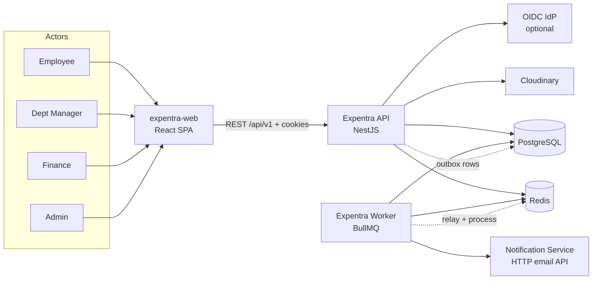

# 01 — System Overview

## 1. Business purpose

Expentra supports the full internal expense cycle for an organization:

```text
Draft → Submit → Multi-level approval → Approve/Reject → Reimburse
```

Around that core:

- **Organization** — departments, managers, team views  
- **Finance controls** — annual department budgets, overspend guards, alerts  
- **Compliance** — pluggable expense policy engine (receipt rules, caps, duplicates, weekend travel, etc.)  
- **Identity** — local auth + optional OIDC SSO; fine-grained RBAC  
- **Observability of business actions** — audit log, in-app notifications, email  
- **Analytics** — personal dashboard, org reports, Excel/PDF exports  

The product is **internal/B2E**, not a public multi-tenant SaaS marketplace. Trust boundaries assume a known organization and controlled user provisioning (or domain-restricted SSO auto-provision).

---

## 2. System context (C4 Level 1)



| External system | Purpose |
|-----------------|---------|
| **expentra-web** | Browser SPA; authenticates via JWT + refresh cookie |
| **PostgreSQL** | System of record (domain + outbox) |
| **Redis** | BullMQ, auth context cache, rate limits, handler idempotency |
| **Cloudinary** | Receipt file storage |
| **Notification HTTP API** | Templated email delivery (optional; logs-only fallback) |
| **OIDC IdP** | Optional enterprise SSO |

---

## 3. Containers (C4 Level 2)

| Container | Technology | Responsibility |
|-----------|------------|----------------|
| **API** | NestJS 11 / Express | REST, auth, business commands/queries, outbox append |
| **Worker** | NestJS application context (no HTTP) | Outbox relay, domain event handlers, email, export, escalation, budget reconciliation |
| **PostgreSQL 15** | Relational DB | Entities + `outbox_events` |
| **Redis 7** | In-memory | Queues + ephemeral operational state |

Same **Docker image** runs API or Worker via command/env (`APP_ROLE`, process entry).

---

## 4. Technology stack

| Layer | Choice |
|-------|--------|
| Language | TypeScript (Node 22 in Docker/CI) |
| Framework | NestJS 11 (`@nestjs/platform-express`) |
| ORM | TypeORM 0.3 + `pg` |
| Validation | `class-validator` / `class-transformer`; env via **Joi** |
| Auth | Passport JWT, refresh cookie, bcrypt; optional OIDC |
| Authorization | Application-level RBAC + CASL-style abilities |
| Queues | BullMQ + `@nestjs/bullmq` + ioredis |
| Files | Cloudinary SDK |
| Docs (opt-in) | Swagger UI |
| Metrics | `prom-client` → `/api/metrics` |
| Exports | ExcelJS, PDFKit |
| Package manager | pnpm 9 |

---

## 5. Architectural style

**Modular monolith** with:

- **Domain modules** (`src/modules/*`) owning controllers, DTOs, services, and domain event registrars  
- **Shared core** (`src/core/*`) for config, security middleware, outbox, Redis, health, metrics  
- **Persistence library** (`src/database/*`) for entities and migrations shared by both processes  
- **Worker processors** isolated in `src/queues/worker-processors.module.ts` and imported **only** by `WorkerModule`  

This is deliberately **not**:

- A multi-service mesh (no gRPC, no Kafka, no service discovery)  
- GraphQL or CQRS-framework (CQRS-ish only in practice: separate query/mutation services in places)  
- Event sourcing (events are integration events, not the source of truth)

---

## 6. Quality attributes

| Attribute | How achieved |
|-----------|--------------|
| **Reliability of side effects** | Transactional outbox; relay retried; domain handlers idempotent keys in Redis |
| **Security** | Helmet, CORS allowlist, JWT + account status + rate limit + deny-by-default access guard |
| **Operability** | Live/ready probes, Prometheus metrics, correlation IDs, optional Bull Board |
| **Evolvability** | Feature modules, interface tokens between controllers and services, migrations |
| **Consistency** | Money as integer minor units; explicit expense state machine; policy severity BLOCK/WARN |

---

## 7. Explicit non-goals (current codebase)

- Payment gateway / bank settlement automation (reimbursement is a domain state, not a PSP integration)  
- Multi-tenancy across unrelated organizations  
- GraphQL / public third-party developer platform  
- Real-time websockets for UI push (notifications are pull + email)
