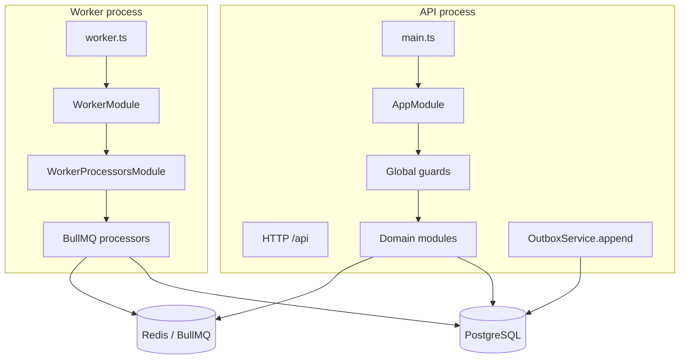

# 02 — Runtime & Application Structure

## 1. Process model



| Concern | API | Worker |
|---------|-----|--------|
| HTTP server | Yes (Express) | No |
| TypeORM / Postgres | Yes | Yes |
| BullMQ **producers** | Yes (jobs that enqueue on demand) | Yes |
| BullMQ **consumers** | **No** | **Yes only** |
| Migrations on start | Configurable (`RUN_MIGRATIONS`) | Always off in compose |
| Seed on start | Configurable (`RUN_SEED`) | Off |

**Rationale:** separates CPU/IO-bound background work from user-facing latency; allows independent horizontal scale of workers.

---

## 2. Source layout

```text
src/
├── main.ts                 # API bootstrap: prefix, versioning, helmet, CORS, pipes
├── worker.ts               # Worker bootstrap: application context only
├── app.module.ts           # API DI root + global guards/interceptors
├── worker.module.ts        # Worker DI root
├── definition.ts           # IAuthUser principal contract
├── core/                   # Infrastructure & cross-cutting
│   ├── config/             # Joi schema, security, validation, redis util
│   ├── guards/             # JWT, account status
│   ├── outbox/             # Transactional outbox + domain event pipeline
│   ├── idempotency/        # Request idempotency keys
│   ├── rate-limiter/       # Redis-backed limits
│   ├── redis/              # Shared Redis module
│   ├── health/ / metrics/  # Ops endpoints
│   ├── cloudinary/         # Receipt storage
│   ├── exceptions/         # Global HTTP filter
│   ├── interceptors/       # Response transform, request logging
│   └── ...
├── database/
│   ├── data-source.ts      # TypeORM DataSource (shared)
│   ├── entities/
│   ├── migrations/
│   └── seeders/
├── modules/                # Bounded feature modules (see §3)
└── queues/
    └── worker-processors.module.ts   # Consumer registration (worker only)
```

---

## 3. Domain modules

| Module path | Responsibility |
|-------------|----------------|
| `auth` | Sign-in/up, tokens, password reset, email verification, OIDC SSO |
| `authorization` | Permission model, abilities, `AccessGuard`, access review |
| `user` | Profile, admin user lifecycle, department assignment |
| `role` | Roles, permission sets, templates |
| `department` | Org structure, managers, managed-team dashboards |
| `expense` | Draft/update/submit/reopen/reimburse, comments, finance exports |
| `receipt` | Upload/list/view/download receipts (Cloudinary) |
| `approval` | Approve/reject, levels, bulk ops, escalation, delegations |
| `budget` | Department annual budgets, alerts, reconciliation job |
| `policy` | Rule CRUD + catalog + evaluation engine |
| `notification` | In-app notifications, preferences, email processor |
| `audit` | Audit log persistence from domain events |
| `dashboard` | Personal dashboard + export |
| `report` | Org spending analytics + Excel/PDF |
| `export` | Async export job orchestration |

### Composition pattern

Typical module structure:

```text
modules/<name>/
├── controllers/
├── services/           # command & query services
├── dtos/
├── contracts/          # I*Service interfaces + DI tokens (where used)
├── processors/         # worker-only (if any)
├── registrars/         # domain event handler registration
└── <name>.module.ts
```

Controllers depend on **interfaces + injection tokens** where established (e.g. `AUTH_SERVICE`), not concrete implementations — supports test doubles and keeps the presentation layer thin.

---

## 4. HTTP request pipeline

Order of global concerns on each request:

```text
1. CorrelationIdMiddleware     → X-Request-Id
2. Helmet (+ cookie-parser)
3. Routing (/api + URI version)
4. JwtAuthGuard                → unless @Public()
5. AccountStatusGuard          → email verified + not suspended
6. RateLimitGuard              → Redis-backed
7. AccessGuard                 → CASL policies / @AllowAuthenticated
8. ValidationPipe + TrimPipe
9. Controller → Service
10. TransformInterceptor       → response envelope
11. ClassSerializerInterceptor → @Exclude on entities
12. MetricsInterceptor / RequestLoggingInterceptor
13. HttpErrorFilter            → error envelope
```

Registered in:

- Bootstrap: `src/main.ts`  
- Guards/interceptors as `APP_*` providers: `src/app.module.ts`

---

## 5. Worker consumers

Registered exclusively in `WorkerProcessorsModule`:

| Queue name (logical) | Processor | Purpose |
|----------------------|-----------|---------|
| `outbox-relay` | `OutboxRelayProcessor` | Poll/dispatch `outbox_events` → `domain-events` |
| `domain-events` | `DomainEventProcessor` | Dispatch to registered handlers (notify, audit, routing, …) |
| `email` (notification queue constant) | `EmailNotificationProcessor` | External email API |
| export queue | `ExportProcessor` | Heavy export generation |
| approval escalation queue | `ApprovalEscalationProcessor` | Stale approval escalation |
| budget reconciliation queue | `BudgetReconciliationProcessor` | Periodic budget consistency |

Worker-only schedulers:

- `OutboxRelaySchedulerService`  
- `BudgetReconciliationSchedulerService`  

**Rule:** never import `WorkerProcessorsModule` into `AppModule`.

---

## 6. Docker entry sequence

`scripts/docker-entrypoint.sh`:

1. Environment present  
2. Wait for Postgres + Redis TCP  
3. Optionally run TypeORM migrations (`RUN_MIGRATIONS=true`)  
4. Optionally seed (`RUN_SEED=true`)  
5. `exec` the process command (`node dist/main.js` or `node dist/worker.js`)

---

## 7. Local vs staging topology

| Environment | Compose file | Image | API bind |
|-------------|--------------|-------|----------|
| Local dev | `docker-compose.yml` | Build local | `3200` |
| Staging VPS | `compose.staging.yml` | Pull `${IMAGE_NAME}` | `127.0.0.1:3201` (proxy in front) |

See [08 — Operations](./08-operations.md) and [VPS deploy guide](../vps-deploy-guide.md).
