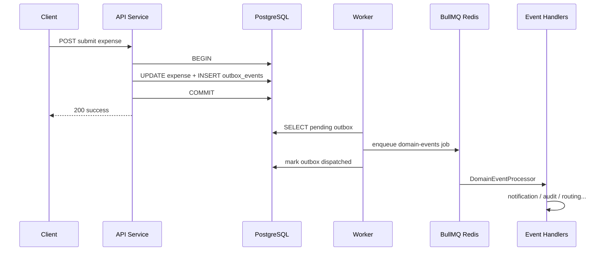

# 06 — Async Messaging & Integrations

## 1. Transactional outbox (critical path)

Expentra does **not** publish to Redis from the middle of an unverified domain write. Reliable integration events use the **transactional outbox** pattern.

### Components

| Component | Path role |
|-----------|-----------|
| `DomainEventPublisher` | Domain-facing API: `publish(eventType, payload, { manager?, idempotencyKey? })` |
| `OutboxService.append` | Writes `outbox_events` (optionally same `EntityManager` as business TX) |
| `OutboxRelayProcessor` + scheduler | Drains pending rows, enqueues BullMQ jobs |
| `DomainEventProcessor` | Invokes handlers for `eventType` |
| `DomainEventHandlerRegistry` | Handler fan-out |
| `DomainEventIdempotencyService` | Redis keys prevent duplicate handler side-effects |

**Retry:** domain-event jobs use max attempts (`DOMAIN_EVENT_MAX_ATTEMPTS`, currently 5). Stuck “dispatched but unfinished” outbox rows can be reclaimed after a configured window.

**Idempotency key** on outbox rows avoids duplicate event inserts under retries of the same business action.

---

## 2. Queue inventory

| Queue (constant) | Consumer process | Responsibility |
|------------------|------------------|----------------|
| `outbox-relay` | Worker | Move DB outbox → domain-events queue |
| `domain-events` | Worker | Fan-out to registered listeners |
| Email notification queue | Worker | Call external notification HTTP API |
| Export queue | Worker | Generate large Excel/PDF artifacts |
| Approval escalation queue | Worker | Age overdue approvals (`expense.escalated`) |
| Budget reconciliation queue | Worker | Periodic budget consistency |

API process may **add jobs** to some queues (e.g. export kick-off) but does **not** host the consumer processors.

---

## 3. Handler registrars

Modules register interest at startup:

| Registrar area | Consumes |
|----------------|----------|
| Notification | User-facing email + in-app create |
| Audit | Immutable audit trail rows |
| Approval | Routing / next-level activation style reactions |
| Budget | Threshold / overspend reactions |

Handlers must be **safe under at-least-once delivery** (idempotency keys, unique constraints, or status checks).

---

## 4. External integrations

### Cloudinary

- Receipt upload and secure delivery  
- Config: `CLOUDINARY_CLOUD_NAME`, `API_KEY`, `API_SECRET`, folder  
- Abstraction under `core/cloudinary` + receipt module storage adapter  

### Notification service

- HTTP API (`NOTIFICATION_SERVICE_URL`, `NOTIFICATION_CLIENT_ID`)  
- Used by email processor for verification, password reset, expense-status mail  
- If unset, system should degrade to **log-only** behavior (operational fallback)  

### OIDC IdP

- See [05 — Security](./05-security.md)  
- Optional; local auth remains supported  

### Prometheus

- Scrape `GET /api/metrics`  
- HTTP metrics via interceptor  

### Frontend

- CORS + `APP_URL` for deep links in emails  

---

## 5. What not to do in request handlers

| Anti-pattern | Preferred |
|--------------|-----------|
| Fire-and-forget Redis email after successful commit without outbox | Publish domain event in same TX |
| Long Excel generation inline in HTTP | Enqueue export job; return job reference / poll pattern already used by export module |
| Swallowing handler errors silently without queue retries | Let processor fail → retry; log exhaustion |

---

## 6. Domain event payload guidelines

- Prefer **internal numeric IDs** in payloads for efficient joins; include references when clients may see them.  
- Keep payloads small (IDs, not full aggregates).  
- Never put raw passwords or long-lived secrets in payloads.  
- Sensitive auth tokens in verification/reset events are redacted in processing logs via payload redaction utilities.
